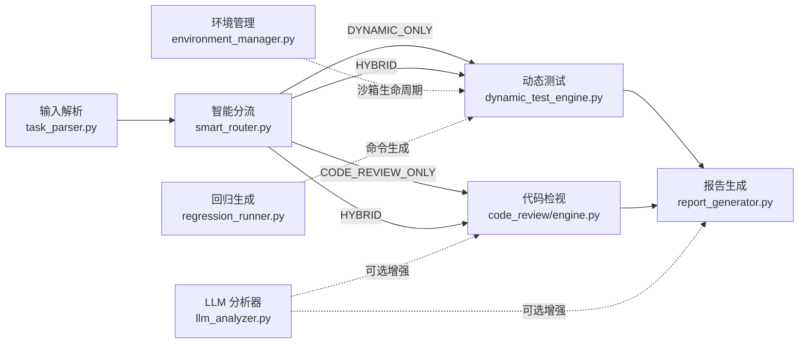
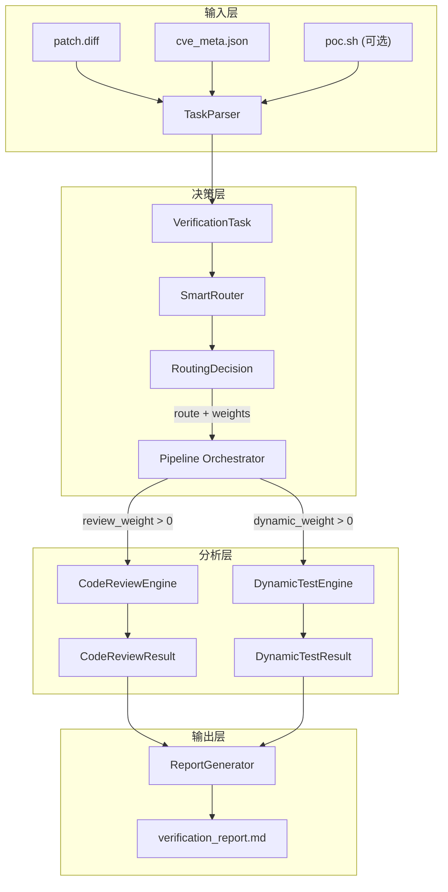

# 系统架构

CVE 补丁自动化验证系统的技术架构，从 Agent 视角描述各模块的职责和交互。

## 流水线总览



## 模块职责矩阵

| 模块 | 输入 | 输出 | 职责 |
|------|------|------|------|
| `task_parser.py` | diff 文件 + JSON 元数据 | `VerificationTask` | 解析 unified diff、CVE 元数据、检测 PoC |
| `smart_router.py` | `VerificationTask` | `RoutingDecision` | 4 维评分矩阵决策验证路径 |
| `code_review/engine.py` | `VerificationTask` | `CodeReviewResult` | 编排 4 阶段代码检视流水线 |
| `code_review/relevance.py` | `PatchedFile` + `Task` | 关联性描述 `str` | 文件路径/CVE ID/关键词匹配 |
| `code_review/fix_pattern.py` | `PatchedFile` | 修复模式描述 `str` | 7 类修复模式正则识别 |
| `code_review/logic_checker.py` | `PatchedFile` + `Task` | 逻辑评估 `str` | CWE 一致性 + 完整性 + 关注要点 |
| `code_review/risk_assessor.py` | `List[PatchedFile]` + `Task` | `List[RegressionRisk]` | 6 类衍生风险检测 |
| `code_review/ai_reviewer.py` | `VerificationTask` | AI 分析结果 `dict` | LLM 深度语义分析（可选） |
| `dynamic_test_engine.py` | `VerificationTask` | `DynamicTestResult` | 沙箱部署 + PoC 执行 + 回归测试 |
| `environment_manager.py` | 沙箱配置 | 沙箱实例操作 | Strategy 模式管理沙箱生命周期 |
| `regression_runner.py` | `VerificationTask` | 回归命令列表 | 基于组件类型生成回归测试命令 |
| `llm_analyzer.py` | CVE 上下文 + diff | 结构化 JSON | OpenAI-compatible API 交互 |
| `report_generator.py` | `VerificationReport` | Markdown 字符串 | 渲染分章节报告 + AI 占位符 |
| `main.py` | CLI 参数 | `VerificationReport` | 编排完整流水线 |
| `models.py` | — | — | 17 dataclass + 7 Enum（含向后兼容别名） |
| `exceptions.py` | — | — | 5 级异常层次结构 |

## 核心数据流



## 代码检视子模块 — 组合模式

`code_review/engine.py` 使用**组合模式**编排 4 个分析器：

```
CodeReviewEngine
├── RelevanceAnalyzer     → 关联性分析
├── FixPatternIdentifier  → 修复模式识别 (7 类正则)
├── LogicChecker          → 逻辑合理性 (CWE 映射, 完整性, 关注要点)
├── RiskAssessor          → 衍生风险 (6 类: 签名/控制流/数据流/资源/错误处理/跨文件)
└── AIReviewer            → LLM 深度分析 (可选)
```

## 设计模式索引

| 模式 | 位置 | 说明 |
|------|------|------|
| Strategy | `environment_manager.py` | `SandboxBackendDriver` 接口解耦沙箱后端 |
| Composition | `code_review/engine.py` | 4 + 1 分析器组合 |
| Graceful Degradation | `llm_analyzer.py`, `ai_reviewer.py` | LLM 不可用时静默回退 |
| Builder | `report_generator.py` | 按章节构建 Markdown 报告 |
| Data Transfer Object | `models.py` | 17 个 dataclass 定义数据契约 |
